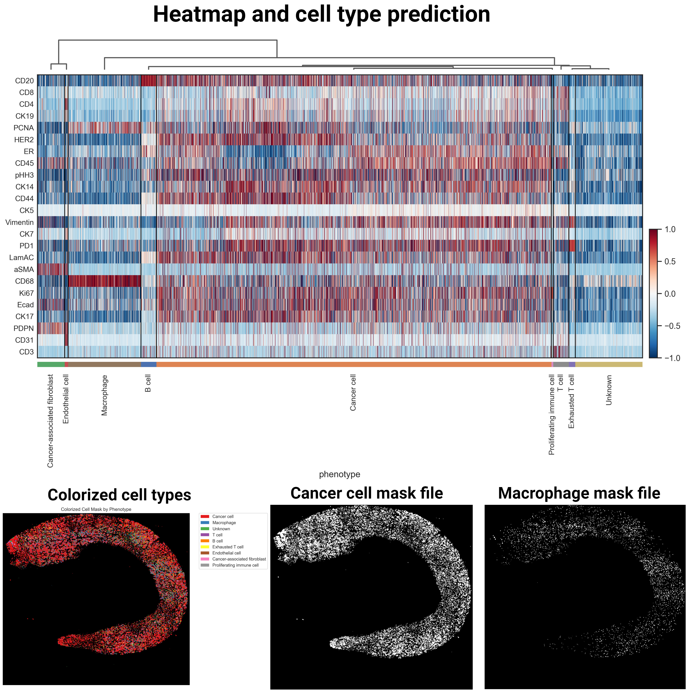

# Cell-Level Radiation Dosimetry Explorer (CellRad-DE)

**Cell-Level Radiation Dosimetry Explorer (CellRad-DE)** is an advanced, scalable toolkit designed to comprehensively analyze radiation dosimetry at the cellular level. This tool uses high-dimensional multiplexed images as inputs to acquire high-resolution, multiplexed data. These data inputs enable precise cell segmentation and automatic cell annotation, which is critical for detailed cellular analysis. The software predicts the energy deposition of various radionuclides within different cell types based on specific markers of interest. Utilizing advanced algorithms, this toolkit can accurately model the spatial distribution of radionuclide energy deposition at the subcellular level. This capability is essential for understanding the differential effects of targeted radionuclide therapies at the cellular level. In addition to its robust analytical capabilities, the software is designed to be efficient and user-friendly, providing an intuitive interface that facilitates complex data analysis without requiring extensive computational expertise. This makes it an invaluable tool for molecular radiology and radiation oncology researchers, enabling them to conduct detailed dosimetry studies, optimize therapeutic strategies, and ultimately enhance the precision and efficacy of cancer treatments.

## Key Features

- **Multiplex Imaging Integration**: CellRad-DE supports all different imaging techniques, including Cyclic Immunofluorescence (CycIF), Multiplexed Ion Beam Imaging (MIBI), and Imaging Mass Cytometry (IMC), allowing for high-dimensional, multiplexed data analysis.
- **Automated Cell Segmentation and Annotation**: The software generates precise cell segmentation masks and automatically annotates cells based on provided markers, streamlining the analysis process.
- **Monte Carlo Simulation**: Leveraging sophisticated Monte Carlo simulations, CellRad-DE predicts dose uptake within each cell type, focusing on nuclei to assess DNA damage accurately.
- **Marker and Radionuclide Optimization**: The tool helps researchers determine the most effective radiation oncology methods and radionuclides for specific markers. It also predicts the optimal markers for each radionuclide, enhancing the precision of targeted therapies.
- **User-Friendly Interface**: Designed with the user in mind, CellRad-DE offers an intuitive interface that simplifies complex analyses, making it accessible to both novice and experienced researchers.

## Application and Benefits

CellRad-DE is a toolkit for advancing the understanding of cellular damage from radionuclide therapy. By integrating multiplex imaging data and performing detailed dosimetry analyses, this software enables researchers to:
- Identify the best radionuclides for use in radionuclide therapy based on different cellular markers.
- Predict the optimal radionuclide therapy doses to minimize the adverse effects.
- Assess potential DNA damage across various cell types, aiding in developing more effective and personalized radionuclide therapies.

## Contributors
Arvin Haj-Mirzaian; Victor Valladolid Onecha; Alejandro Bertolet Reina; Umar Mahmood; Pedram Heidari

## Step-by-Step Tutorial
### Installation
#### Step 1: Install Miniconda
  - Install Miniconda
    Download the Miniconda installer for your operating system from the Miniconda download page (https://docs.anaconda.com/free/miniconda/index.html).
    Run the installer and follow the installation instructions.

#### Step 2: Install Git
##### Linux:
```bash
sudo apt-get update
sudo apt-get install git -y
```
##### macOS:
```bash
brew install git
```
##### Windows:
Download the Git for Windows installer from the Git for Windows download page (https://git-scm.com/downloads).
Run the installer and follow the installation instructions.

#### Step 3: Clone the repository and installation
The installation will automatically create a Conda environment named 'CellRad-DE'. Please open a terminal (or Git Bash on Windows) and execute the following command:
```bash
git clone https://github.com/arvinhm/CellRad-DE.git
cd CellRad-DE
python setup.py create_conda_env
conda activate CellRad-DE
pip install -e .
```
##### Apple silicon M1/M2/M3
Apple silicon users might encounter issues during installation due to package conflicts with Deepcell and TensorFlow.

### Inputs and data preparation
This toolkit is compatible with any size of high-dimensional multiplexed images and MERFISH Spatial Transcriptomics or Visium HD (for geometric dosimetry). However, for very large image sizes, we recommend considering using a server cluster to ensure optimal performance.
In addition to the image files (typically in *.ome.tif format), two CSV files are required for this toolkit to predict cell type annotations. Please refer to the example files in the 'examples' folder. The **'markers'** CSV file should describe all markers used for multiplex imaging. Note that all DNA channels should be renamed to DAPI, regardless of the specific DNA stain used, as the software recognizes the nuclei channel as 'DAPI'. The **'marker_cell_types'** CSV file lists all the markers and their associated cell types based on the markers used. For instance, if your experiment visualizes Macrophages, B cells, and T cells using CD45 as an immune cell marker, you should list all these cell types next to the CD45 row. If a marker is specific to one cell type, only the targeted cell type should be mentioned; for example, CD20 should be listed with B cells only. This file should be meticulously prepared to ensure optimal and accurate cell type annotation.
This toolkit requires three main files: the **'ome.tif'** file, **'markers.csv'**, and **'marker_cell_types.csv'**. We recommend placing all these files in the 'processing' directory and following the tutorial in the 'notebooks' directory. For a step-by-step tutorial, please follow the notebooks in the 'notebooks' folder. Below are descriptions of each function used in this toolkit.

### Major functions
#### resize
If users use a personal computer and consider resizing the image to save memory, use the function below. However, we do not recommend using this function if the pixel size is higher than 0.65 microns and the field of view is greater than 5 mm. Resizing the image may decrease the accuracy of cell segmentation.

```bash
resize(input_path, output_path, resize_ratio)
# Example
resize('path/to/image.ome.tif', 'path/to/output.ome.tif', 2)
```
```input_path```: Path to the original image
```output_path```: Path to the resized output image
```resize_ratio```: The factor by which to divide the image dimensions
#### segment_cells
In this function, by leveraging a deep learning model ([Deepcell](https://github.com/vanvalenlab/intro-to-deepcell) <sup>1</sup>), users can segment cells based on the DNA channel (DAPI) and a membrane (recommended) or cytoplasm marker.

<sub><i> 1. Greenwald, N.F., Miller, G., Moen, E., Kong, A., Kagel, A., Dougherty, T., Fullaway, C.C., McIntosh, B.J., Leow, K.X., Schwartz, M.S., and Pavelchek, C., 2022. Whole-cell segmentation of tissue images with human-level performance using large-scale data annotation and deep learning. Nature Biotechnology, 40(4), pp.555-565.</i></sub>

```bash
segment_cells(input_path, output_path, dapi_idx, membrane_idx, pixel_size, token)
Example:
segment_cells('path/to/origina_image.ome.tif', 'path/to/cell_segmentation.ome.tif', '24', '25', pixel_size='auto', token='e8MkSMdE.L6p85e7ToAR6UShqyzkSJP1m9H6WeZ2r')
```

```input_path```: Path to the original image
```output_path```: Path to the predicted cell segmentation mask
```dapi_idx```: The channel number where DAPI is (channel number starts from 0)
```membrane_idx```: The channel number where membrane or cytoplasm is (channel number starts from 0)
```pixel_size```: Pixel size; has two parameters. If the user chooses 'auto,'  it automatically finds the pixel size from the ome.tif file, or the user can enter it manually, i.e., '0.325.'
```token```: This function required a token from Deepcell. User can sign up https://datasets.deepcell.org/join and get their token. 

#### extract_single_cell_data
This function extracts all cell information, including the location and size of the cells, as well as marker expression in each cell. The outputs are saved in three formats: **'cell_data.csv'**, **'cell_data.h5ad'**, and **'cell_data_spatial.npy'**.

```bash
extract_single_cell_data(masks, image, channel_names, output_dir)
Example:
extract_single_cell_data(masks='path/to/cell_segmentation.ome.tif', image='path/to/original_image.ome.tif', channel_names='path/to/.csv', output_dir='path/to/output')
```

```masks```: Path to the predicted cell segmentation (generated by ```segment_cells``` function)
```image```: Path to the original image
```channel_names```: Path to **'markers.csv'** (described earlier)
```output_dir```: Path to the output files

#### celltype_prediction
This function automatically predicts the cell types using the **'marker_cell_types.csv'** file. The accuracy of the prediction depends on the accuracy of the file preparation and marker expression. The output will be **'barcodes_and_phenotypes'** (including cell IDs and predicted cell types), a heatmap of scaled marker expression and annotation, a colorized mask file of all cell types, and binary mask files for each cell type (these files will then be used for simulation in target cells).

```bash
celltype_prediction(adata_path, marker_csv_path, mask_path, output_path)
celltype_prediction(adata_path='path/to/cell_data.h5ad', marker_csv_path='path/to/marker_cell_types.csv', mask_path='path/to/cell_segmentation.ome.tif', output_path='path/to/output')
```
```adata_path```: Path to cell_data.h5ad (generated by ```extract_single_cell_data``` function)
```marker_csv_path```: Path to the **'marker_cell_types.csv'** (described earlier)
```mask_path```: Path to the predicted cell segmentation (generated by ```segment_cells``` function)
```output_dir```: : Path to the output files


#### simulation
##### Coming soon ...

#### analyzer
##### Coming soon ...

## License
<p xmlns:cc="http://creativecommons.org/ns#" xmlns:dct="http://purl.org/dc/terms/"><a property="dct:title" rel="cc:attributionURL" href="https://github.com/arvinhm/CellRad-DE">Cell-Level Radiation Dosimetry Explorer (CellRad-DE)</a> by <a rel="cc:attributionURL dct:creator" property="cc:attributionName" href="https://github.com/arvinhm">Arvin Haj-Mirzaian, Victor Valladolid Onecha, Alejandro Bertolet Reina, Umar Mahmood, and Pedram Heidari</a> is licensed under <a href="https://creativecommons.org/licenses/by-nc-nd/4.0/?ref=chooser-v1" target="_blank" rel="license noopener noreferrer" style="display:inline-block;">CC BY-NC-ND 4.0</a></p>
